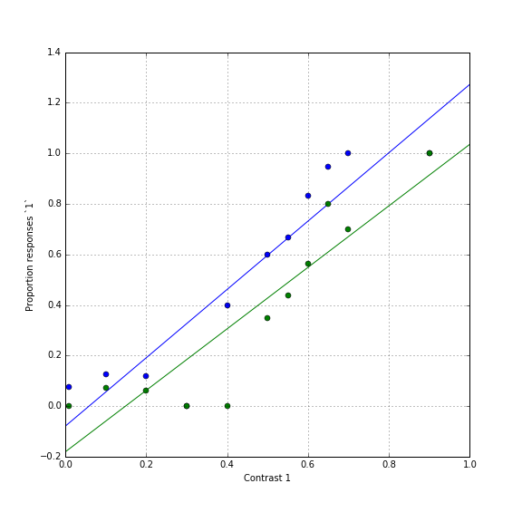
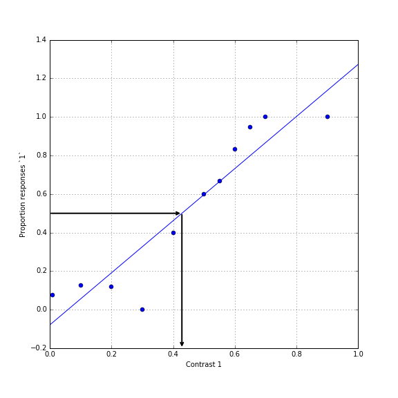
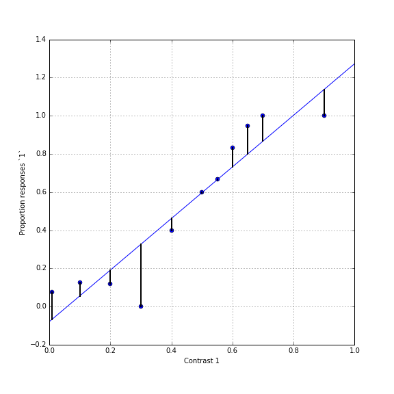

# Linear models.

> ## Learning Objectives {.objectives}
>
> * Learners can identify a linear model.
> * Learners can use `scipy.stats` to fit a linear model to data

The main distinction we will make in this lesson is between linear models and
non-linear models. Linear models are models that can be described by the
following functional form:

$\bf{y} = \beta_0 + \beta_1 \bf{x}_1 + \beta_2 \bf{x}_2 + ... + \beta_n \bf{x}_n + \epsilon$,

where $\bf{y}$ denotes the dependent variable or variables (that's why it's
bold-faced: it could be a vector!) in your experiment. $\bf{x}_i$ are sets of
dependent variables (also, possibly vectors) and $\beta_i$ are parameters.
Finally, $\epsilon$ is the noise in the experiment. You can also think about
$\epsilon$ as all the things that your model doesn't know about. For example, in
the visual experiment described, changes in participants wakefulness might
affect performance in a systematic way, but unless we explicitely measure
wakefulness and add it as an independent variable to our analysis (as another
$\bf{x}$), we don't know it's value on each trial and it goes into the noise.

How do we choose $beta_i$?

Selecting a value for the parameters, $beta_i$ is called "fitting the model".
You might , but a common criterion is to select parameters that reduce the sum
of the square errors, relative to the data (SSE). That is, let:

$SSE = \sum{(y - \hat{y})^2}

And:

$\hat{y} = $

We will want to

It turns out that linear models are easy to fit. Under some fairly generic
assumptions (for example that $\epsilon$ has a zero-mean normal distribution),
there is actually an analytic solution to this problem. That is, you can plug it
into a formula and get the exact solution: the set of $\beta$ that give you the
smallest SSE between the data you collected and the function defined by the
parameters.

> ## Linearized models {.callout}
>  Because linear models are easy to fit, if you can transform your data somehow
>  to get it into a linear form, you should definitely do that.

Let's fit a linear model to our data. In our case, a linear model would
be a straight line in 2D:

$y = \beta_0 + \beta_1 x$

Where, $\beta_0$ is the intercept and $\beta_1$ is the slope.

This function is a special case of a larger set of functions called
"polynomials" (see below). The `numpy` library contains a function for fitting
of these functions, `np.polyfit`

> ## Polynomial functions {.callout}
> This family of functions has the general form:
>
> $\beta_0 + \beta_1 x + \beta_2 x^2 + ... \beta_n x^n$
>
> where we say that the "degree" of the polynomial is the highest non-zero power
> of x that is represented in the function. More formally, it is the highest
> value of n, such that $\beta_n \neq 0$.

The function `np.polyfit` requires three arguments, a vector of x values, a
vector of y values and an integer, signifying the degree of the polynomial we
wish to fit.

~~~ {.python}

beta_ortho = np.polyfit(x_ortho, y_ortho, 1)
beta_para = np.polyfit(x_para, y_para, 1)

~~~

Reading the documentation of polyfit, you will learn that this function returns
a tuple with the beta coefficient values, ordered from the *highest* degree to
the *lowest* degree.

That is, for the linear (degree=1) function we are fitting here, the slope is
the first coeffiecient and the intercept of the function is the second
coefficient in the tuple. To match the notation we used in our equations, we
can assign as:

~~~ {.python}

beta1_ortho = beta_ortho[0]
beta0_ortho = beta_ortho[1]

~~~

> ## Python tuples {.callout}
>
> Python tuples are a lot like lists, they are ordered sets of items arranged
> in order. For example:
>
> `my_tuple = (1, 2, 3)`
>
> The main difference between tuples and lists (you should have seen lists in the [software carpentry python lessons](http://swcarpentry.github.io/python-novice-inflammation/03-lists.html)
> is that the items in lists can be changed after they are allocated, and
> tuples are "immutable"

We can also write the above function as follows, splitting the tuple up as it
comes out of the function:

~~~ {.python}

beta1_ortho, beta0_ortho = np.polyfit(x_ortho, y_ortho, 1)
beta1_para, beta1_para = np.polyfit(x_para, y_para, 1)

~~~

Note that because these values of $\beta$ are not the "true" values of these
coefficients and are just estimates based on the sample we've observed, we
mark them as an estimate by putting a hat on them: $\\hat{beta}$.

The inverse of `np.polyfit` is the function `np.polyval' that takes these values
$\\hat{beta}$ and values of the independent variable (x), and produces estimated
values of the dependent variable: $\hat{y}$, according to the polynomial
function.

We'll estimate this for a broad range of the independent variable, covering the
full range that was in the measurements:

~~~ {.python}
x = np.linspace(0, 1, 100)  # What does linspace do?
y_ortho_hat = np.polyval((beta1_ortho, beta0_ortho), x)
y_para_hat = np.polyval((beta1_para, beta0_para), x)

~~~

Let's visualize the result of this:

~~~ {.python}

fig, ax = plt.subplots(1)
ax.plot(x, y_ortho_hat)
ax.plot(x_ortho, y_ortho, 'bo')
ax.plot(x, y_para_hat)
ax.plot(x_para, y_para, 'go')

ax.set_xlabel('Contrast 1')
ax.set_ylabel('Proportion responses `1`')
ax.grid('on')
fig.set_size_inches([8,8])

~~~

Recall that we wanted to know the value of the PSE for the two conditions. That
is the value of x for which $\hat{y} = 0.5$. For example, for the orthogonal
surround condition:

In this case, we'll need to do a little bit of algebra. We set y=0.5, and solve
for x:

$0.5 = \beta_0 + \beta_1 x$

$ \Rightarrow 0.5 - \beta_0 = \beta_1 x$

$ \Rightarrow x = \frac{0.5- \beta_0}{\beta1}$

Or in code:

~~~ {.python}

pse_ortho = (0.5 - beta0_ortho)/beta1_ortho
pse_para = (0.5 - beta0_para)/beta1_para

~~~

## Evaluating models

How good is the model? Let's look at the model "residuals", the difference between the model and the measured data:

